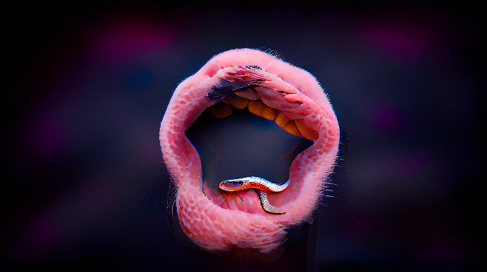

# The Geniverse API

<!-- Discord Badge

Geniverse Channel ID: 896000995010687046

Geniverse Invite Link: https://discord.gg/mzurTxGEa3

-->

[](https://discord.gg/qjvkwPCg)
<a href="https://pypi.org/project/geniverse/0.1.10/">
    
</a>


```
   ______           _                         
  / ____/__  ____  (_)   _____  _____________ 
 / / __/ _ \/ __ \/ / | / / _ \/ ___/ ___/ _ \
/ /_/ /  __/ / / / /| |/ /  __/ /  (__  )  __/
\____/\___/_/ /_/_/ |___/\___/_/  /____/\___/ 
                                              
Generate art from text and images with 3 lines.
```



_Text prompt: "A snake eating itself" --- by
[Victor](https://twitter.com/viccpoes "Link to the tweet containing a snake
eating itself")_

## Install
```bash
pip install geniverse
```
## Usage
With this example we can generate `"a genierative universe"` using `VQGAN`. The
result is a list of [PIL](https://pillow.readthedocs.io/) images. Docs will be
released soon :)

```python
from geniverse.models import TamingDecoder
taming_decoder = TamingDecoder()
image_list = taming_decoder.generate_from_prompt("a generative universe")
```

For now you can generate images from text prompts, interpolate and create
infinite zooms with your results. More examples soon :)

## Models

So far we have adapted to our pipeline the following models:
- [VQGAN](https://compvis.github.io/taming-transformers/ "Reference to the VQGAN
  microsite")
- [Aphantasia](https://github.com/eps696/aphantasia "Reference to the Aphantasia
  GitHub repository")
- [Mini-Dalle](https://github.com/borisdayma/dalle-mini "Reference to the Mini
  Dall-E GitHub repository")

